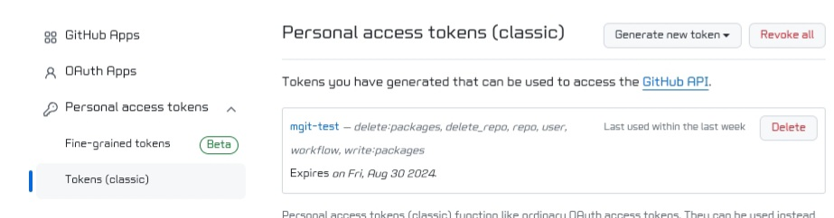
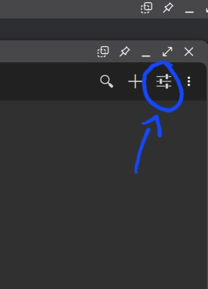
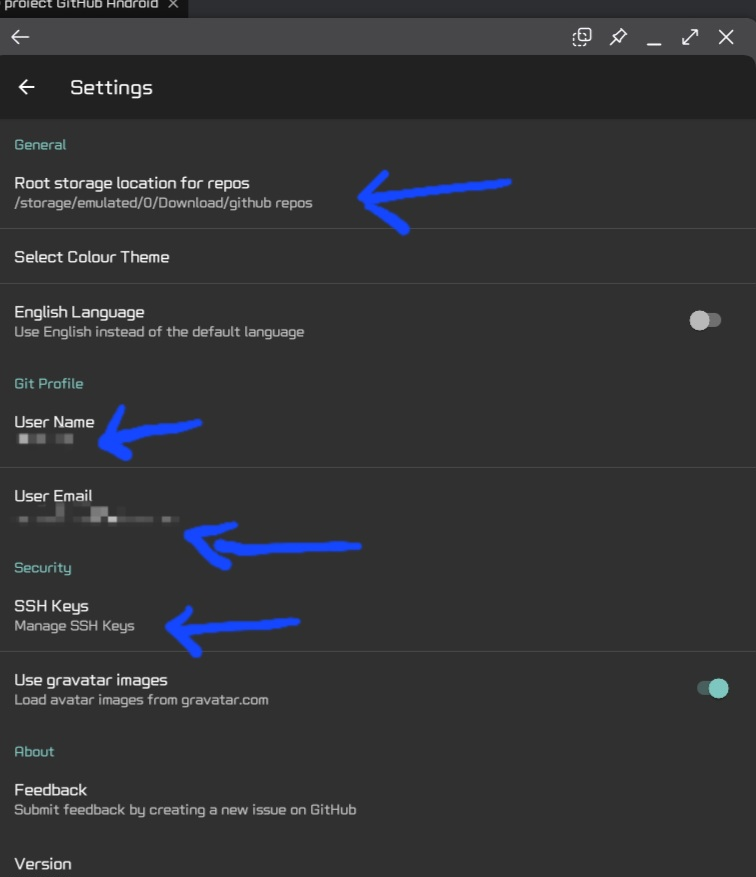
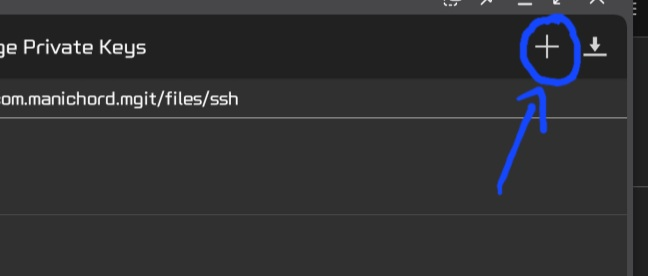
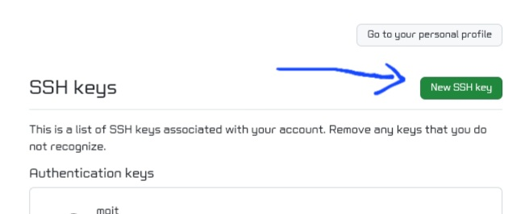
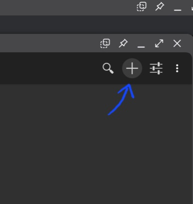
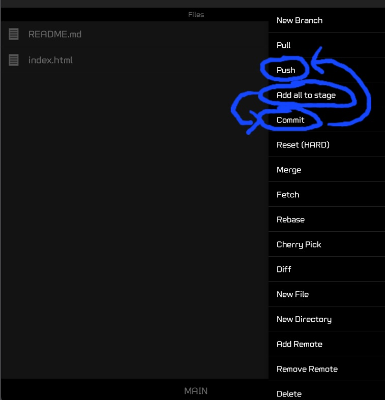

# Project Description

This project is intended for those who want to use their mobile phone, with Samsung DeX capabilities, specifically for coding. Below are the steps to follow:

## Initial Setup for Your GitHub Account

1. **Generate a Personal Access Token:**
   - First, set up your personal GitHub account by generating a personal access token (classic mode). Make sure to grant the necessary permissions.

2. **Install MGit:**
    - You can use the MGit apk, which can be downloaded from [F-Droid](https://f-droid.org/en/packages/com.manichord.mgit/) or from GitHub [here](https://github.com/maks/MGit). It is one of the best and easiest app to use for cloning, committing, and pushing to GitHub.
   - After installing the MGit app, go to the settings and configure the location where you want to save projects from GitHub.

   - Enter your GitHub username and the email address associated with your GitHub account.

   - Generate a new SSH key within the MGit app and import it into your GitHub account under the **SSH and GPG Keys** section.

## Cloning a Repository

- To clone a repository to your phone's storage, you can use the MGit app.

## Making Changes and Pushing to Your Repository

- After cloning a repository to your phone's storage, you can add or delete files as needed. To push these changes to your personal GitHub repository, follow these steps:

1. **Clone the Personal Repository:**
   - Use mGit to clone your personal repository to your phone's storage.

2. **Make the Desired Changes:**
   - Make any changes you want to the files in the repository.

3. **Stage, Commit, and Push:**
   - Execute the following commands in mGit:
     1. `add all to stage`
     2. `commit`
     3. `push`

    

   - During the push, a prompt will appear indicating that you don't have the correct credentials. Close this prompt and enter:
     - **Author**: your GitHub username
     - **Password**: the personal access token you created on GitHub

4. **Successful Push:**
   - After entering the credentials, the push will be successfully executed to your personal repository on GitHub.

## Editing Files

- To edit files in the repository, you can use various applications like Codespace, Stackblitz, or Codesandbox.

## Limitations

- Note that in locally installed coding applications on your phone, entire folders cannot be uploaded due to the FileSystem API limitations of browsers.

This detailed guide should help users set up and use their mobile phones for coding with Samsung DeX and mGit.